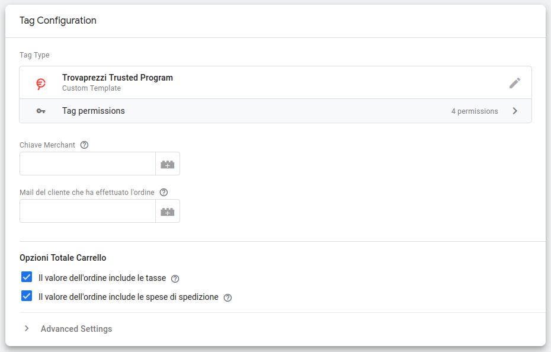

# Trovaprezzi Trusted Program Google Tag Manager Tag Template

Tag template ufficiale per il programma Trusted Program di Trovaprezzi.it da usare in Google Tag Manager.




[Guida Ufficiale](https://drezzy.it/...)

## Sviluppo

- Per editare il template importare il file `template.tpl` in Google Tag Manager Template Editor e riesportarlo una volta completata la modifica

## Test

- Per testare la funzione principale `tpScript`, chiamata come success callback di `injectScript`, quest'ultimo è stato mockato globalmente in `Setup`

- `assertCalledWith` può essere usato per testare solo la prima chiamata ad un'API (quindi non lo usiamo)

- Per le chiamate successive è necessario inserire l'assert all'interno del mock dell'API

  ```js
  let targetCommandCalled = false;
  mock('callInWindow', (method, command) => {
    if (command.event === 'setEmail') {
      targetCommandCalled = true;
      assertThat(command.id === 'user@example.com');  // assert parametri del comando corretti
    } 
  });
  
  assertThat(targetCommandCalled).isTrue();  // assert evento chiamato almeno una volta
  ```

### Guide

- [Guida alla pubblicazione e aggiornamento](https://developers.google.com/tag-platform/tag-manager/templates/gallery#upload_to_github)
- [Style guide](https://developers.google.com/tag-platform/tag-manager/templates/style) 

## Riferimenti

- [Tag manager custom template APIs](https://developers.google.com/tag-platform/tag-manager/templates/api)
- [Enhanced Ecommerce purchase GTM UA](https://developers.google.com/analytics/devguides/collection/ua/gtm/enhanced-ecommerce#purchases)
- [Ecommerce purchase GTM GA4](https://developers.google.com/analytics/devguides/collection/ga4/ecommerce?client_type=gtm#make_a_purchase_or_issue_a_refund)
- [Schema evento purchase GA4](https://developers.google.com/analytics/devguides/collection/ga4/reference/events#purchase)
- [Schema evento purchase UA](https://developers.google.com/analytics/devguides/collection/ua/gtm/enhanced-ecommerce#purchases)
